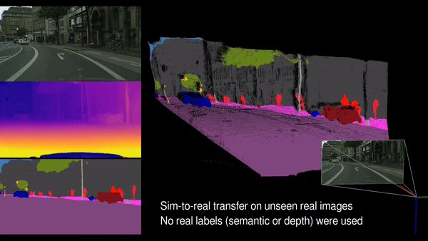
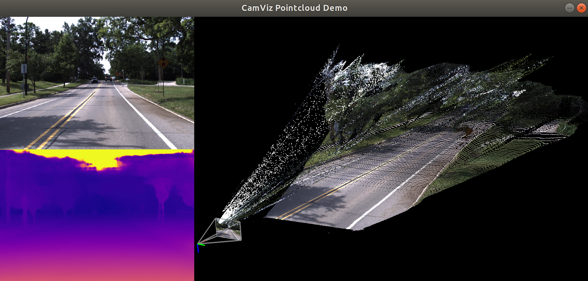

<a href="https://www.tri.global/" target="_blank">
 
</a>

## CamViz

[Overview](#overview) // [Installation](#install) // [Demos](#demos) // [License](#license)

 
 



## Overview 

**CamViz** is a visualization library developed by the TRI-ML team with the goal of providing an interface for the visualization of monocular depth estimation results, both as depth maps and reconstructed pointclouds. It uses [PyGame](https://www.pygame.org/news) for window display and input management (mouse and keyboard), and [OpenGL](https://www.opengl.org//) for 2D and 3D drawing and rendering. It provides an easy and intuitive way to:
- Store information as textures and data buffers for efficient display
- Create 2D environments for image display and 3D environments for pointcloud visualization 
- A pinhole camera class that manages most basic geometric operations (reconstruction, projection, transformation to different coordinate frames, etc.)

Although **CamViz** works as a standalone library, it was designed specifically to be used in conjunction with other TRI-ML's repositories, in particular [PackNet-SFM](https://github.com/tri-ml/packnet-sfm) and [DDAD](https://github.com/tri-ml/ddad). To facilitate integration, it is also provided as a submodule in those repositories. 

## Installation

We provide a `requirements.txt` file with all the required libraries (tested on Ubuntu 18.04). To start using **CamViz** all you need to do is:

```
git clone git@github.com:TRI-ML/camviz.git
cd camviz
pip install -r requirements.txt
PYTHONPATH=$PYTHONPATH:/path/to/camviz
```

## Demos

The **CamViz** repository comes with a demo that visualizes a predicted monocular pointcloud (already calculated, and provided as part of the repository). We plan to include more demos as more functionalities are added, usually tied to scientific publications. 
To run it, type the following command from the root folder:

```
python demos/pointcloud.py
```

The output should look like this:

<a href="https://www.tri.global/" target="_blank">
 
</a>

From this initial display you can:
- Zoom in/out on the images with the mouse wheel, and translate within image boundaries.
- Move freely within the 3D viewer (translation, rotation and zoom in/out) with the mouse.
- Change color modes with the `enter` key.

## License

The source code is released under the [MIT license](LICENSE.md).
